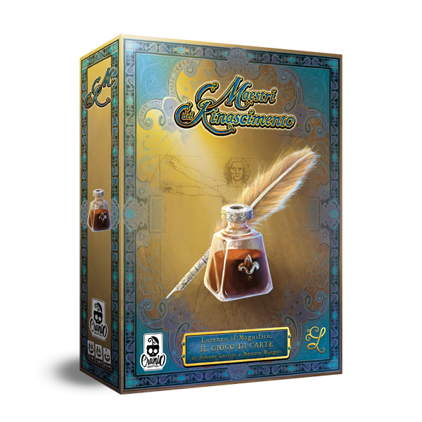
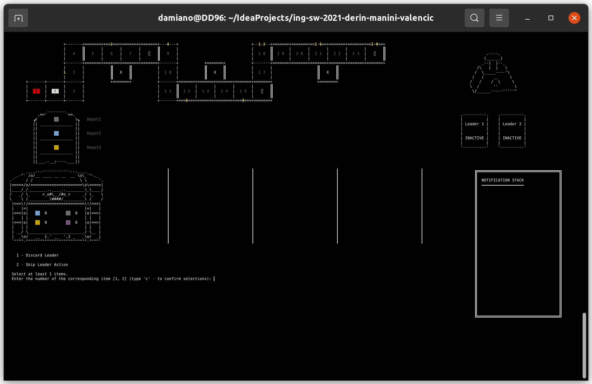
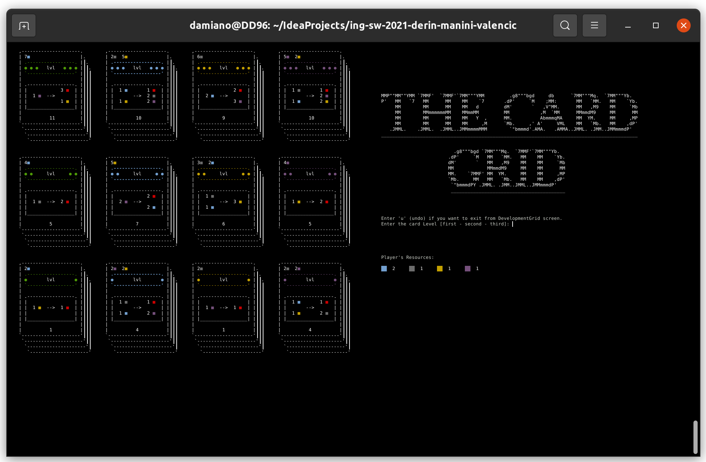
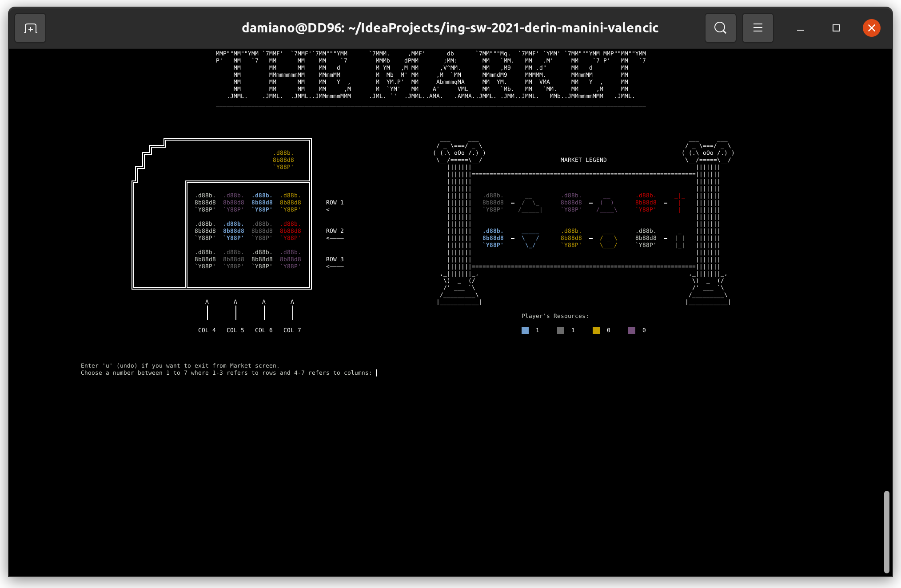
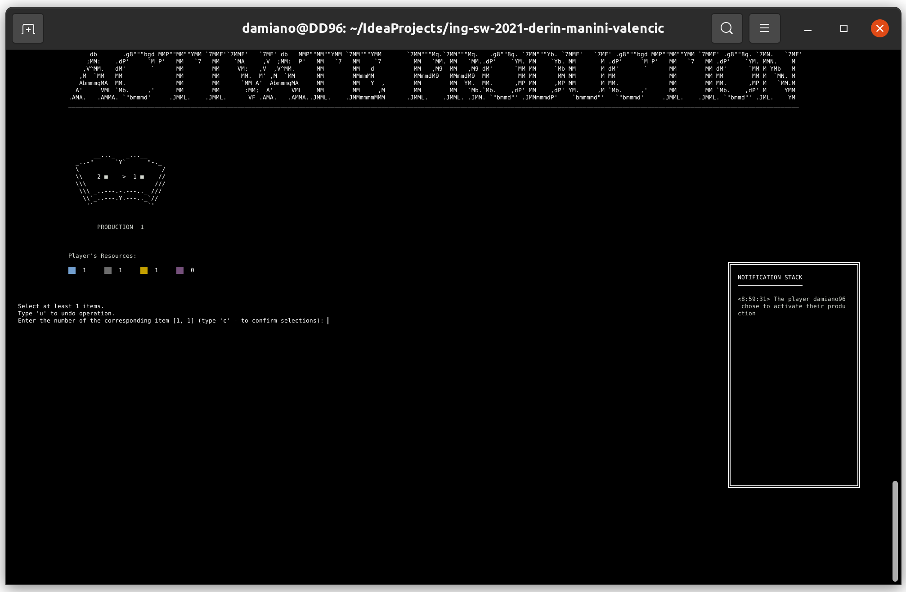

# Software Engineering - Course Project

---

Implementation of the board game: <a href="https://www.craniocreations.it/prodotto/masters-of-renaissance/">Masters of
Renaissance</a>.

<p>
  
</p>

---

<div style="background: rgba(0, 0, 0, 0.2); border-radius: 10px; padding: 10px">
<h6 style="color: #eca400">WARNING!</h6>
<p>
Due to copyright reasons we are not allowed to release assets that are necessary to execute the GUI version of the game.
<br>
<a href="others/GUI_video_example.mp4">Here</a> you can find a short demonstrative gameplay.
<br>
The CLI version is still working.
</p>
</div>

---

## Table of Contents

- [Team Members](#team-members)
- [Implemented Functionalities](#implemented-functionalities)
- [Requirements](#requirements)
- [Usage](#usage)
    - [Step 1: JAR files](#usage-step-1)
        - [Generate JARs](#generate-jars)
    - [Step 2: Running the Server](#usage-step-2)
    - [Step 3: Running the Client](#usage-step-3)
        - [CLI Version](#cli-version)
        - [GUI Version](#gui-version)

<a name="team-members"></a>

## Team Members

In alphabetic order:

| Surname   | Name      | Contact Info                       |
|:----------|:----------|:-----------------------------------|
| Derin     | Damiano   | damiano.derin@mail.polimi.it       |
| Manini    | Andrea    | andrea3.manini@mail.polimi.it      |
| Valencic  | Jas       | jas.valencic@mail.polimi.it        |

<a name="implemented-functionalities"></a>

## Implemented Functionalities

| Requirements                               |
|:-------------------------------------------|
| Complete rules + CLI + GUI + Socket + 3 FA |

| n° | Advanced Functionality        | Short Explanation                                                                                         |
|:---|:------------------------------|:--------------------------------------------------------------------------------------------------------- |
| 1  | Multiple Matches              | The Server can handle more than one match simultaneously.                                                 |
| 2  | Persistence                   | If the Server shuts down, you will be able to restore matches that have been interrupted this way.        |
| 3  | Resilience to Disconnections  | If you lose the connection while playing, you'll be able to restore the match that have been interrupted. |
| <center>**n°**</center> | <center>**Extra Functionality**</center> | <center>**Short Explanation**</center> |
| 1  | Account Creation        | Players can create accounts.                                            |
| 2  | Login                   | Players can login with their credentials.                               |
| 3  | Music and Sound Effects | While playing on GUI, you can play background musics and sound effects. |
| 4  | PDF Rules               | Players can read the PDF with rules of the game.                        |
| 5  | Global Leaderboard      | Thanks to persistence, players can see the scores of all the others.    |

<a name="requirements"></a>

## Requirements

- java >= 11
- junit >= 4.11
- com.google.code.gson >= 2.8.5
- org.openjfx (javafx-controls) >= 15.0.1
- org.openjfx (javafx-fxml) >= 11.0.2
- org.openjfx (javafx-media) >= 11

<a name="usage"></a>

## Usage

<a name="usage-step-1"></a>

### Step 1: JAR files

Following the next steps you will be able to generate the JARs to play the game.

<a name="generate-jars"></a>

#### Generate JARs

- Clone and browse in the directory of the project:

```bash
  $ git clone https://github.com/damiano1996/ing-sw-2021-derin-manini-valencic.git
  $ cd ing-sw-2021-derin-manini-valencic
```

- Execute the following command from terminal to build and to generate JAR files:

```bash
  $ mvn package -Dmaven.test.skip=true
```

- After termination of the build, files will be available in this [directory](deliverables/final/jar).

<a name="usage-step-2"></a>

### Step 2: Running the Server

- The ```server.jar``` can be executed by double click or with the following command in the terminal.

  We suggest executing it by the terminal to stop it easily, otherwise by double click it will run in background and to
  kill the application you should use the task manager.

- Browse with the terminal in the directory where the ```server.jar``` is saved. Then run:

  ```bash
    $ java -jar server.jar
  ```

  At this point the ```server.jar``` should be running.
- To turn off the server, enter the CTRL+C key combination in the terminal.

---

<div style="background: rgba(0, 0, 0, 0.2); border-radius: 10px; padding: 10px">
<h6 style="color: #eca400">WARNING!</h6>
<p>
Do not run more than one server at a time on the same machine:
if you do this, the same socket port will be used by all the servers causing problems.
</p>
</div>

---

<a name="usage-step-3"></a>

### Step 3: Running the Client

<a name="cli-version"></a>

#### CLI Version

<div>
<table>
    <caption>Screenshots from CLI</caption>
    <tbody>
        <tr>
            <td></td>
            <td></td>
        </tr>
        <tr>
            <td></td>
            <td></td>
        </tr>
    </tbody>
</table>
</div>

---

<div style="background: rgba(0, 0, 0, 0.2); border-radius: 10px; padding: 10px">
<h6 style="color: #eca400">WARNING!</h6>
<p>
The CLI version of the game uses ANSI escape codes.<br>
Windows terminal can't render them properly:
in order to have a playable version of the CLI, a Unix-like terminal is required.<br>
If you are on Windows, you must use a WSL terminal to run the CLI JAR.<br>
A nice WSL terminal can be downloaded from the Windows store for free at the following
<a href="https://www.microsoft.com/store/productId/9NBLGGH4MSV6">link</a>.<br>
Lastly, if you use a WSL terminal to run the client.jar (CLI), you won't be able to see the PDF rules,
please use the GUI version instead.  
</p>
</div>

---

In order to run the ```client.jar``` in CLI mode follow these steps:

- Browse with the terminal in the directory where the ```client.jar``` is saved.

- To run the CLI version use this command:
  ```bash
    $ java -jar client.jar "-playingViewMode=cli"
  ```

  At this point the CLI version of the Client JAR should be running.

- To turn off the CLI, you can select the "exit" command in the initial menu of the game.  
  Another way to turn off the CLI is to enter the CTRL+C key combination in the terminal.

<a name="gui-version"></a>

#### GUI Version (No assets, no party)

In order to run the GUI version of the ```client.jar```, simply double-click on the icon of the ```client.jar```.  
At this point the GUI version of the Client JAR should be running.

To turn the GUI off, you can use the "exit" button in the menu.  
Another way to turn the GUI off is to press the "View Board" button while playing and then close the window as usual by
click on the top red X.

Another option is to stop the GUI by the task manager: use this method only if unable to perform the two above.
